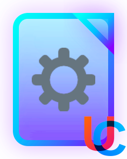
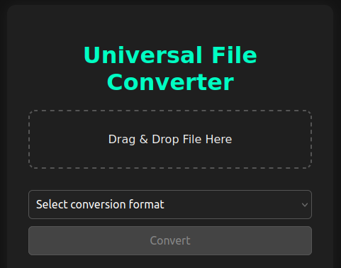

<p align="center">
	
</p>

<h1 align="center">Uniconverter</h1>

<p align="center">
	<strong>Your files, your format!</strong>
</p>

<div style="display: flex;" align="center">
	
	
	
	
</div>

## 🚀 Overview

Welcome to **Uniconverter**! This program allows you to convert files of one type to another using a simple web interface. It is designed to be user-friendly and efficient, making it easy for anyone to convert their files without any technical knowledge.

## 🎨 Features

- 🌑 **Dark Theme**: The program features a sleek dark theme that is easy on the eyes and provides a modern look.
- 🖱️ **Drag and Drop**: Users can easily drag and drop files into the program for conversion, making the process quick and intuitive.
- 📁 **File Preview**: The program allows users to preview the files they want to convert, ensuring they select the correct files before conversion.
- 🗃️ **Folder Support**: Users can upload entire folders of files, making it convenient for batch conversions.
- 🔢 **Multimodality Compatibility**: The program can convert files to different formats, such as video to audio.
- ♾️ **No Conversion Limit**: There are no caps on the number or size of files you can convert.
- 👍 **Docker Compatibility**: The program can be run in a Docker container, making it easy to deploy and use on any system.
- 🫂 **PWA Support**: The program can be installed as a Progressive Web App (PWA), allowing users to run it like a native application on their devices.
- 🧩 **Polyglot Merging**: The program can merge files of different formats into a single output file (that's not an archive).
- ℹ️ **Metadata Extraction**: The program can extract metadata from files, providing users with additional information about their files.

## 🛠️ Installation

**Clone the repository**
```sh
git clone https://github.com/321BadgerCode/uniconverter.git
cd ./uniconverter/
```

<details>

<summary>📦 Dependencies</summary>

- **FFMpeg**: The program requires FFmpeg to be installed on your system. You can download it from the [FFmpeg website](https://www.ffmpeg.org/download.html).
- **Exiftool**: The program uses Exiftool for metadata extraction. You can download it from the [Exiftool website](https://exiftool.org/).
- **Python Packages**: The program uses several Python packages. You can install them using pip:
```sh
pip install -r requirements.txt
```

</details>

> [!NOTE]
> Not all packages are required for the program to run, but some packages are needed for specific conversions or features.

## 📈 Usage

To use the program, you can either run it in python or within a [Docker](https://www.docker.com/) container:

### Using Python

**Run the program**
```sh
python ./app.py
```

### Using Docker

<details>

<summary>📝 Docker Notes</summary>

1. Ensure you have Docker installed on your system. You can find installation instructions on the [Docker website](https://docs.docker.com/get-docker/).
2. The program uses Docker Compose to manage the container. Make sure you have Docker Compose installed as well.
3. The program uses the `docker compose` command, which is the newer syntax for Docker Compose. If you have an older version of Docker Compose, you may need to use `docker-compose` instead.
4. Some helpful commands:
```sh
groups # Check your user groups (you should see `docker` in the list)
newgrp docker # Create a new group session with the `docker` group
sudo usermod -aG docker $USER && sudo reboot # Add your user to the Docker group and reboot
```

</details>

1. **Build the Docker image**
```sh
docker compose up
docker compose up -d # Run in detached mode
```

2. **Access the web interface**
Go to [http://localhost:5000](http://127.0.0.1:5000) in a web browser to access the Uniconverter web interface.
```sh
firefox http://127.0.0.1:5000
```

3. **Stop the Docker container (if ran in detached mode)**
```sh
docker ps # List running containers
docker compose down
```

4. **Cleanup (optional)**
```sh
docker compose down --volumes --remove-orphans # Remove volumes and orphan containers
docker images # List docker images
docker rmi uniconverter-web # Remove the Docker image
```

<details>

<summary>💻 Command Line Arguments</summary>

|	**Argument**		|	**Description**			|	**Default**	|
|	:---:			|	:---:				|	:---:		|
|	`-h & --help`		|	Help menu			|			|
|	`--cleanup`		|	Delete optional files on exit	|	False		|

</details>

## 🛠️ Build

To build the program into an executable (Electron app), you can run the following commands:
```sh
npm install -g nativefier
python ./app.py
```

Then, run the following in a separate terminal session:
```sh
nativefier --single-instance http://localhost:5000
```

> [!NOTE]
> The `nativefier` command will create a standalone application that can be run on your system. You can find the generated folder in the current directory, labeled `Uniconverter-linux-x64` (or similar, depending on your OS). You cannot delete the resource files found in that generated folder after building, as they are required for the application to run.

## 🖼️ Screenshots

<p align="center">
	
</p>

## 🤝 Contributing

Contributions are welcome! If you have any suggestions or improvements, feel free to open an issue or submit a pull request. Please run the following to setup the development environment:
```sh
chmod +x ./setup_dev.sh
./setup_dev.sh
```

This establishes the Git commit template and commitmsg hook, which ensures that all commits follow the project's commit message guidelines.

## 📜 License

[LICENSE](./LICENSE)
