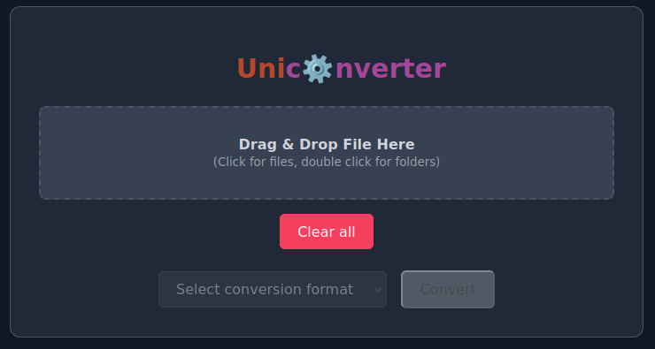

<p align="center">
	
</p>

<h1 align="center">Uniconverter</h1>

<p align="center">
	<strong>Convert filetypes!</strong>
</p>

## 🚀 Overview

Welcome to **Uniconverter**! This program allows you to convert files of one type to another using a simple web interface. It is designed to be user-friendly and efficient, making it easy for anyone to convert their files without any technical knowledge.

## 🎨 Features

- **Dark Theme**: The program features a sleek dark theme that is easy on the eyes and provides a modern look.
- **Drag and Drop**: Users can easily drag and drop files into the program for conversion, making the process quick and intuitive.
- **File Preview**: The program allows users to preview the files they want to convert, ensuring they select the correct files before conversion.

## 🛠️ Installation

To get started with the program, follow the steps below:

1. **Clone the Repository**
```sh
git clone https://github.com/321BadgerCode/uniconverter.git
cd ./uniconverter/
```

<details>

<summary>📦 Dependencies</summary>

- **FFMpeg**: The program requires FFmpeg to be installed on your system. You can download it from the [FFmpeg website](https://www.ffmpeg.org/download.html).
- **Python Packages**: The program uses several Python packages. You can install them using pip:
```sh
pip install -r requirements.txt
```

</details>

> [!NOTE]
> Not all packages are required for the program to run, but some packages are needed for specific conversions or features.

## 📈 Usage

To use the program, there is only **one** step!

1. **Run the program**
```sh
python ./app.py
```

<details>

<summary>💻 Command Line Arguments</summary>

|	**Argument**		|	**Description**			|	**Default**	|
|	:---:			|	:---:				|	:---:		|
|	`-h & --help`		|	Help menu			|			|
|	`--cleanup`		|	Delete optional files on exit	|	False		|

</details>

## 🖼️ Screenshots

<p align="center">
	
</p>

## 📜 License

[LICENSE](./LICENSE)